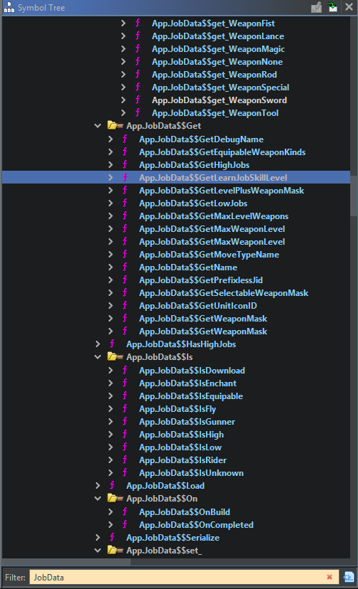
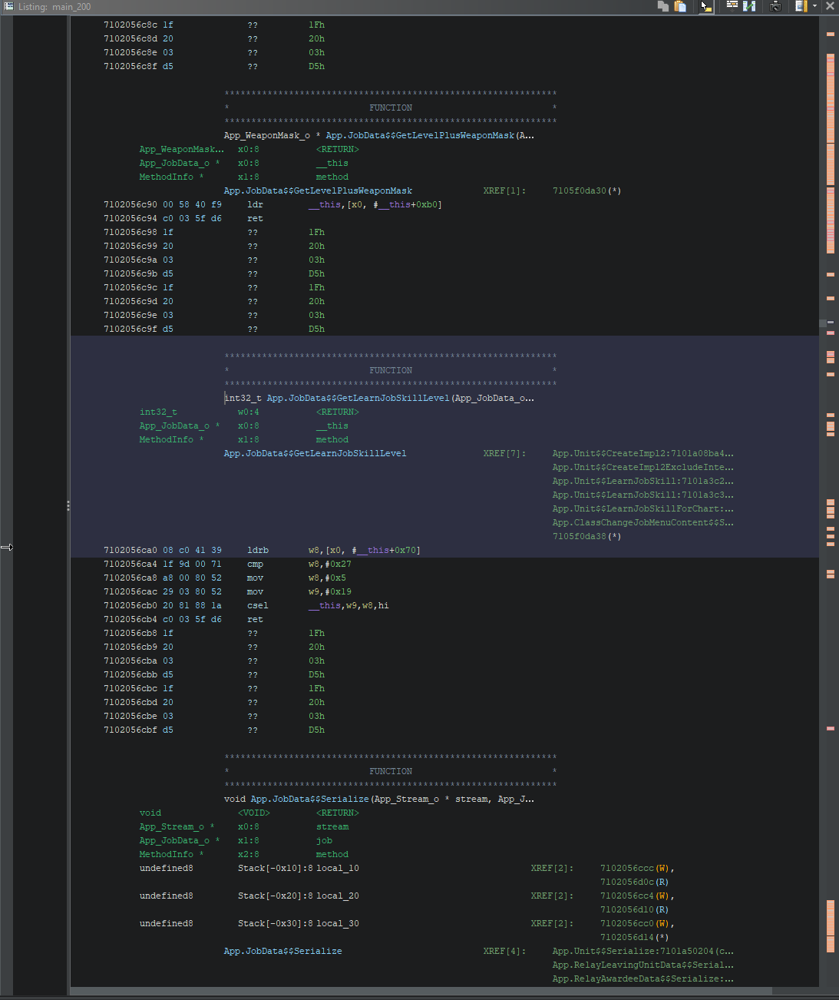

# Starting with Ghidra

To start with Ghidra, lets look at it's layout. Your's may slightly vary.

On the left is the Symbol Tree, it shows all symbols within the current program. You can search here to find symbols by name.

On the bottom left is the Data Type Manager, it contains all data types within the current program. You can again search to find data types by name. This is useful when creating structs.

On the right is the Decompiler Window, it shows the currently selected function decompiled to C like pseudo code. It is a good way to see what a function is actually doing.

Lastly in the middle is the Disassembly. It is the disassembled data of the program. This contains functions, strings and more.

