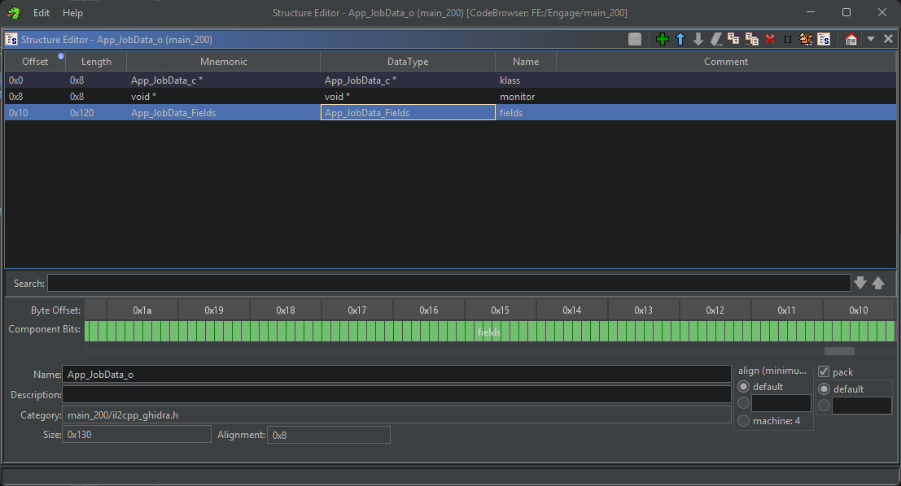
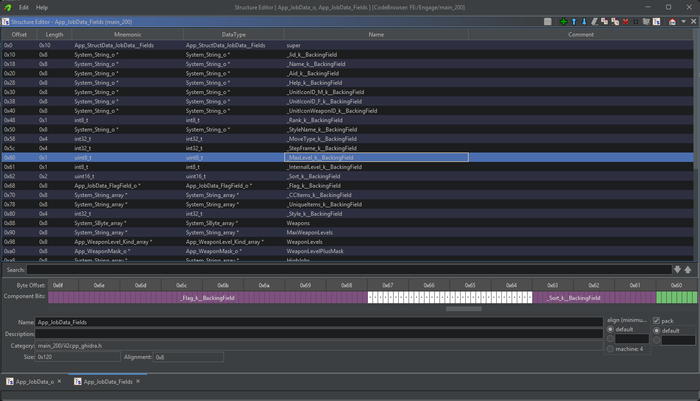

# Analyzing a Function

With the tools introduced at a basic level, lets start with an example. Search for JobData in the Symbol Tree and find App.JobData$$App.JobData$$GetLearnJobSkillLevel. Clicking it will jump to the function in the Dissasembly View. On the right is decopiled code, it should read:

``` 
int32_t App.JobData$$GetLearnJobSkillLevel(App_JobData_o *__this,MethodInfo *method)

{
  int32_t iVar1;
  
  iVar1 = 0x19;
  if ((__this->fields)._MaxLevel_k__BackingField < 0x28) {
    iVar1 = 5;
  }
  return iVar1;
}
```

What does this tell us? It takes in App_JobData_o and MethodInfo and returns an integer, the level that a class learns a skill. App_JobData_o is a data type. 

We can see the fields of __this, App_JobData_o is being accessed for _MaxLevel_k__BackingField. But what is _MaxLevel_k__BackingField? Well, lets start at App_JobData_o.

Searching for it in the Data Type Manager can let us see what it actually contains. Double clicking it there will bring up a new window, the structure editor.



Well, that doesn't tell us much, but we see more data types. Right click App_JobData_Fields and click "Edit Component" to open it in a new tab, you can also search for it in the Data Type Manager if you'd like.



With App_JobData_Fields opened, we can see more data types. We can find _MaxLevel_k__BackingField at offset 0x60 and see it's an unsigned integer. Looking back at the function, we can see it is being check to see if it is less than 0x48, or 40 in decimal. To determine what level a class should learn it's skill, if it is less than 40, then it is learned at level 5, otherwise it is learned at 0x19, which is 25.

Feel free to explore more functions and trying to understand what they are doing and how it is done.

In the next chapter, we will utilize Rust to recreate this example and create a mod that will change the level at which skills are learned.