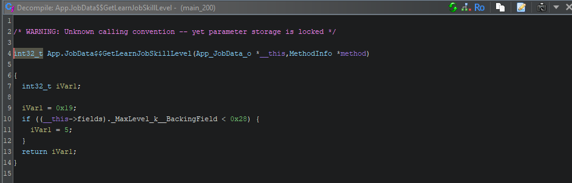

# Basic Example

### Set Up

To begin, create a new skyline project. You can name it whatever you'd like. Open the project in your preferred coding environment and open lib.rs. We can delete the `println!("Hello from skyline plugin");` as we won't need it. We need to add the feature macro of ptr_sub_ptr to the beginning of our file `#![feature(ptr_sub_ptr)]`.

Next, let us add the crates.

### Adding Crates

We will begin with adding the unity crate. We can add the crate by opening a terminal in our project folder or coding enviroment and entering `cargo add --git https://github.com/DivineDragonFanClub/unity`, however this will give us an error, we must enter the package name as well. So to add the unity crate let's run `https://github.com/DivineDragonFanClub/unity unity`. Next, let's add the engage crate. We can add it the same way as unity, `cargo add --git https://github.com/DivineDragonFanClub/engage`. With both these crates installed, let's add the unity crate prelude to our project. To do so, we must add `use unity::prelude::*;` to our code. Add it at the beginning and now our code should look like:
```rs
#![feature(ptr_sub_ptr)]
use unity::prelude::*;

#[skyline::main(name = "book-example")]
pub fn main() {
    
}
```

Additionally, our cargo.toml file should have the two crates we added.

```
[package]
name = "book-example"
version = "0.1.0"
authors = []
edition = "2021"

[package.metadata.skyline]
titleid = "01006A800016E000" # Smash Ultimate

[lib]
crate-type = ["cdylib"]

[dependencies]
engage = { git = "https://github.com/DivineDragonFanClub/engage", version = "0.10.0" }
skyline = "0.3.0"
unity = { git = "https://github.com/DivineDragonFanClub/unity", version = "0.3.0" }

[profile.dev]
panic = "abort"

[profile.release]
panic = "abort"
lto = true
```

### Hooking a function

Next, we will hook a function. We will use the example from Chapter 3, `App.JobData$$GetLearnJobSkillLevel`. Add a unity hook macro before main with a new function defined below it. You should reference Ghidra to get the arguments for the function.




You can see the two arguments, this and method. As mentioned before, these argument names are very important and we should keep them in our Rust function. This this argument has data type `App_JobData_o`. Luckily, the engage crate has this structure defined already. We can import it by adding `use engage::gamedata::JobData;
` below our unity prelude import.

```rs
use unity::prelude::*;
use engage::gamedata::JobData;
```

We that, we should be ready to write the macro and function. Again, start with the macro call `#[unity::hook("App", "JobData", "GetLearnJobSkillLevel")]` then define the function after it. The function can be named anything, but it is important for it to be recognizable to you and others who may read your code. For the arguments, we can define this with `this: &JobData` and method with `method_info: OptionalMethod`. OptionalMethod was imported with the unity prelude. The function returns a 32 bit integer, i32 in Rust. With the function and hook defined, we should have as follows:

```rs
#[unity::hook("App", "JobData", "GetLearnJobSkillLevel")]
pub fn jobdata_getlearnjobskilllevel(this: &JobData, method_info: OptionalMethod) -> i32 {

}
```

Let us add the call original macro to it. The arguments for the call original macro should be this and method_info.

```rs
#[unity::hook("App", "JobData", "GetLearnJobSkillLevel")]
pub fn jobdata_getlearnjobskilllevel(this: &JobData, method_info: OptionalMethod) -> i32 {
    call_original!(this, method_info)
}
```

If we were to compile this now, we wouldn't see much change. Let's assign the call original to a variable and return that variable.

```rs
#[unity::hook("App", "JobData", "GetLearnJobSkillLevel")]
pub fn jobdata_getlearnjobskilllevel(this: &JobData, method_info: OptionalMethod) -> i32 {
    let level = call_original!(this, method_info);
    level
}
```

Add a println call before the return to see if we hooked the function correctly.

```rs
#[unity::hook("App", "JobData", "GetLearnJobSkillLevel")]
pub fn jobdata_getlearnjobskilllevel(this: &JobData, method_info: OptionalMethod) -> i32 {
    let level = call_original!(this, method_info);
    println!("Howdy!");
    level
}
```

In order for the hook to run, we need to install it in main. We can use the skyline install_hook macro to do so.

```rs
#[skyline::main(name = "book-example")]
pub fn main() {
    skyline::install_hook!(jobdata_getlearnjobskilllevel);
}
```

Overall our file should look as follows:

```rs
#![feature(ptr_sub_ptr)]

use unity::prelude::*;
use engage::gamedata::JobData;

#[unity::hook("App", "JobData", "GetLearnJobSkillLevel")]
pub fn jobdata_getlearnjobskilllevel(this: &JobData, method_info: OptionalMethod) -> i32 {
    let level = call_original!(this, method_info);
    println!("Howdy!");
    level
}

#[skyline::main(name = "book-example")]
pub fn main() {
    skyline::install_hook!(jobdata_getlearnjobskilllevel);
}
```

Now compile the program to an nro and install it to your mods folder. Run the game and check the class change screen to see if our hook runs.


Our hook is running, but it's not doing much yet. In the next part we will rewrite the original function in Rust instead of relying in the call_original macro.
