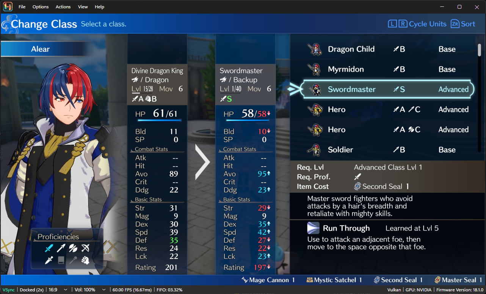
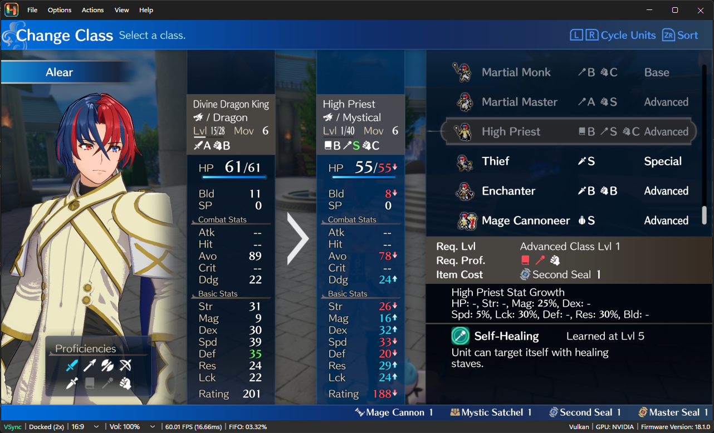

# Basic Example Continued

Now that we got our hook running, let us try and recreate the function using the Ghidra decompile as reference. For now, lets just rewrite it how we see it.

### Recreating the Function

We can see `(this->fields)._MaxLevel_k__BackingField` in the if statement, the predefined JobData structure has this as a field defined for us. We can access this value using `this.max_level`. You can consult the crate documentation or source code to determine what fields are public in a structure.

```rs
#[unity::hook("App", "JobData", "GetLearnJobSkillLevel")]
pub fn jobdata_getlearnjobskilllevel(this: &JobData, method_info: OptionalMethod) -> i32 {
    let level = 0x19;
    if this.max_level < 0x28 {
        let level = 5;
    }
    level
}
```

### Fixing Functionality

This function looks like the decompile, but we can build it and see it will not function the same, the level will always return 25, lets convert the hex to decimal to start.

```rs
#[unity::hook("App", "JobData", "GetLearnJobSkillLevel")]
pub fn jobdata_getlearnjobskilllevel(this: &JobData, method_info: OptionalMethod) -> i32 {
    let level = 25;
    if this.max_level < 40 {
        let level = 5;
    }
    level
}
```

The fix is rather simple, we can just return in the if statement.

```rs
#[unity::hook("App", "JobData", "GetLearnJobSkillLevel")]
pub fn jobdata_getlearnjobskilllevel(this: &JobData, method_info: OptionalMethod) -> i32 {
    let level = 25;
    if this.max_level < 40 {
        let level = 5;
        return level;
    }
    level
}
```

While this does work, it's not the best as it is now, we can try and rewrite it to make it look nicer and function the exact same way.

### Alternative Approaches

Next, let's rewrite it and make it return 5 for classes that do not have a max level of 40, we have multiple approaches to this. First, lets make level mutable so we can change it's value in the if statement. An alterantive we will also explore is making it an if else statement. Any approach can be taken, but some may be better than others. Below are both:

```rs
#[unity::hook("App", "JobData", "GetLearnJobSkillLevel")]
pub fn jobdata_getlearnjobskilllevel(this: &JobData, method_info: OptionalMethod) -> i32 {
    let mut level = 25;
    if this.max_level < 40 {
        level = 5;
    }
    level
}
```
This looks more similar to the decompiled function.

```rs
#[unity::hook("App", "JobData", "GetLearnJobSkillLevel")]
pub fn jobdata_getlearnjobskilllevel(this: &JobData, method_info: OptionalMethod) -> i32 {
    if this.max_level < 40 {
        5
    } else {
        25
    }
}
```

This has more branches, which may make the logical more readable to some.

We should test in game to see if the function acts identically. For special classes we should expect level 25 and for advanced classes it should be 5.





We have the function near identical in function to the decompile. This is an ideal function as it's easy to represent in Rust. Not all functions will be like this, and some will require more work to rewrite.

### Extras

You may have noticed during the building of the nro, a warning was in the console, `warning: unused variable: method_info`. method_info is no longer used in our function, but we cannot just remove the argument. Instead, to fix the warning, we can append a underscore to the beginning of the name `_method_info`. This will prevent the compiler from giving us the warning, as we let it know this is intentionally unused.

We should also add panic handling to our plugin. When the plugin panic, it will give us more information on where and why. The [Template](https://github.com/DivineDragonFanClub/plugin_hub/blob/master/00%20-%20Template/src/lib.rs) in the [plugin_hub repo](https://github.com/DivineDragonFanClub/plugin_hub) gives us a good one to start. Lets add that to our main function, we can remove the comments from it. We also will change the text a bit to make it more specific to our plugin, changing the error code also will allow us to identify it as our plugin.

```rs
#[skyline::main(name = "book-example")]
pub fn main() {
    std::panic::set_hook(Box::new(|info| {
        let location = info.location().unwrap();

        let msg = match info.payload().downcast_ref::<&'static str>() {
            Some(s) => *s,
            None => {
                match info.payload().downcast_ref::<String>() {
                    Some(s) => &s[..],
                    None => "Box<Any>",
                }
            },
        };

        let err_msg = format!(
            "Example plugin has panicked at '{}' with the following message:\n{}\0",
            location,
            msg
        );

        skyline::error::show_error(
            67,
            "Example plugin has panicked! Please open the details and send a screenshot to the developer, then close the game.\n\0",
            err_msg.as_str(),
        );
    }));

    skyline::install_hook!(jobdata_getlearnjobskilllevel);
}
```

The error message will only show when the plugin panics, if the game crashes we will have to analyze the stack trace, which can be done with Ghidra.

In the next part, we will add logic to the hooked function, allowing us to change how the function operates.